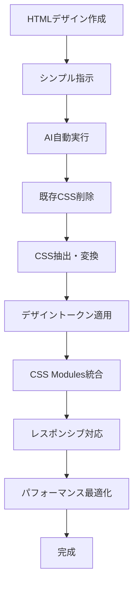

# タイピングゲーム CSS設計ベストプラクティス

## 📋 目次
1. [概要](#概要)
2. [CSS アーキテクチャ設計](#css-アーキテクチャ設計)
3. [デザインシステム](#デザインシステム)
4. [コンポーネント設計パターン](#コンポーネント設計パターン)
5. [完全デザイン移行手順](#完全デザイン移行手順)
6. [パフォーマンス最適化](#パフォーマンス最適化)
7. [レスポンシブ対応](#レスポンシブ対応)
8. [アクセシビリティ](#アクセシビリティ)
9. [DPIスケール対応](#dpiスケール対応)

---

## 概要

このドキュメントは、モダンなタイピングゲーム開発における**CSS設計のベストプラクティス**を定義します。

### ✨ 特徴
- **Next.js 14 + CSS Modules** の最新アーキテクチャ
- **デザイントークン中心**の統一性
- **BEM記法**によるコンポーネント設計
- **ゲーミングUI**に特化した視覚効果
- **HTML→React完全移行**のワークフロー

---

## CSS アーキテクチャ設計

### 📁 ファイル構造

```
src/
├── styles/
│   ├── design-tokens/           # デザイントークン（単一責任）
│   │   ├── colors.css          # カラーパレット
│   │   ├── typography.css      # フォント・文字設定
│   │   ├── spacing.css         # 余白・レイアウト
│   │   ├── breakpoints.css     # ブレークポイント
│   │   └── animations.css      # アニメーション設定
│   ├── components/             # コンポーネント専用CSS
│   │   ├── SimpleGameScreen.module.css
│   │   ├── MainMenu.module.css
│   │   └── Table.module.css
│   ├── globals-reset.css       # CSS Reset
│   ├── design-system.css       # 共通ユーティリティ
│   └── design-tokens.css       # 統合トークン
└── app/
    ├── globals.css             # アプリ全体設定
    └── globals-new.css         # 新アーキテクチャ用
```

### 🎯 アーキテクチャ原則

1. **デザイントークン駆動設計**
   ```css
   /* ❌ 悪い例：ハードコーディング */
   .button {
     color: #e0e0e0;
     font-size: 16px;
     padding: 12px 24px;
   }

   /* ✅ 良い例：デザイントークン使用 */
   .button {
     color: var(--color-gaming-text-primary);
     font-size: var(--font-size-base);
     padding: var(--spacing-game-sm) var(--spacing-game-md);
   }
   ```

2. **CSS Modules による名前空間分離**
   ```css
   /* SimpleGameScreen.module.css */
   .gameScreen {
     background: var(--color-bg-primary);
   }
   
   .gameScreen__container {
     max-width: var(--container-lg);
   }
   ```

3. **BEM記法によるコンポーネント設計**
   ```css
   .modal { /* Block */ }
   .modal__content { /* Element */ }
   .modal--large { /* Modifier */ }
   ```

---

## デザインシステム

### 🎨 カラーシステム

```css
:root {
  /* Gaming Theme Colors */
  --color-gaming-bg-primary: #0a0f1b;
  --color-gaming-bg-secondary: #1a2740;
  --color-gaming-text-primary: #e0e0e0;
  --color-gaming-text-accent: #ffd88a;
  
  /* Semantic Colors */
  --color-text-primary: var(--color-gaming-text-primary);
  --color-bg-primary: radial-gradient(circle, #0a0f1b 0%, #000000 100%);
  
  /* State Colors */
  --color-game-typed: #a3d8ff;    /* 入力済み文字 */
  --color-game-focus: #ffe18d;    /* 現在の文字 */
  --color-game-remaining: #9c7e5c; /* 未入力文字 */
}
```

### ✍️ タイポグラフィシステム

```css
:root {
  /* Font Families */
  --font-family-primary: 'Noto Sans JP', -apple-system, BlinkMacSystemFont, sans-serif;
  --font-family-game: 'Cinzel', serif;
  
  /* Font Sizes - ゲームUI最適化 */
  --font-size-xs: 0.75rem;    /* 12px - UI小要素 */
  --font-size-sm: 0.875rem;   /* 14px - ボタン・ラベル */
  --font-size-base: 1rem;     /* 16px - 基本テキスト */
  --font-size-lg: 1.125rem;   /* 18px - サブタイトル */
  --font-size-xl: 1.25rem;    /* 20px - ローマ字表示 */
  --font-size-2xl: 1.5rem;    /* 24px - 日本語表示 */
  --font-size-game-title: clamp(2.5rem, 6vw, 4rem); /* タイトル */
}
```

### 📐 スペーシングシステム

```css
:root {
  /* 基本スペーシング */
  --spacing-xs: 0.25rem;   /* 4px */
  --spacing-sm: 0.5rem;    /* 8px */
  --spacing-md: 1rem;      /* 16px */
  --spacing-lg: 1.5rem;    /* 24px */
  --spacing-xl: 2rem;      /* 32px */
  
  /* ゲーム専用スペーシング */
  --spacing-game-xs: var(--spacing-sm);
  --spacing-game-sm: var(--spacing-md);
  --spacing-game-md: var(--spacing-lg);
  --spacing-game-lg: var(--spacing-xl);
}
```

---

## コンポーネント設計パターン

### 🎮 ゲーム画面コンポーネント

```css
/* SimpleGameScreen.module.css */

/* メインコンテナ - フルスクリーン固定 */
.gameScreen {
  width: 100%;
  height: 100vh;
  background: var(--color-bg-primary);
  font-family: var(--font-family-game);
  display: flex;
  flex-direction: column;
  justify-content: center;
  align-items: center;
  color: var(--color-gaming-text-secondary);
  margin: 0;
  padding: 2rem 0;
  box-sizing: border-box;
  gap: 2rem;
}

/* タイピングエリア */
.typingContainer {
  max-width: 720px;
  width: 90%;
  padding: 2rem;
  background: var(--color-game-window-bg);
  background-image: url('/textures/old-wall.png');
  background-blend-mode: overlay;
  border: 1px solid rgba(0, 0, 0, 0.15);
  border-radius: 14px;
  box-shadow: 
    0 8px 20px rgba(0, 0, 0, 0.3), 
    inset 0 0 30px rgba(255, 255, 255, 0.15);
  text-align: center;
}

/* テキスト表示 */
.japaneseText {
  font-size: var(--font-size-2xl);
  font-weight: bold;
  letter-spacing: 0.05rem;
  margin-bottom: 1.5rem;
  line-height: 1.8;
  background: var(--color-game-text-gradient);
  -webkit-background-clip: text;
  -webkit-text-fill-color: transparent;
  background-clip: text;
  text-shadow: 0 0 1px #fff, 0 0 2px rgba(0,0,0,0.6);
}

.romajiText {
  font-size: var(--font-size-xl);
  font-weight: 900;
  letter-spacing: 0.05rem;
  line-height: 1.6;
  display: inline-block;
  white-space: pre-wrap;
  text-shadow: 0 0 1px rgba(0,0,0,0.3);
}

/* タイピング状態の文字 */
.typed {
  color: var(--color-game-typed);
}

.active {
  color: var(--color-game-focus);
}

.remaining {
  color: var(--color-game-remaining);
}
```

### 🏆 結果画面コンポーネント

```css
/* SimpleGameResultScreen.module.css */

/* フルスクリーンオーバーレイ */
.resultScreen {
  position: fixed;
  top: 0;
  left: 0;
  width: 100vw;
  height: 100vh;
  z-index: var(--z-index-modal, 1000);
  background: radial-gradient(ellipse at center, #0a0f1b, #000);
  font-family: var(--font-family-game);
  color: #ccc;
  overflow: hidden;
  display: flex;
  flex-direction: column;
  align-items: center;
  padding-top: 10vh;
  padding-bottom: 4rem;
  box-sizing: border-box;
  margin: 0;
}

/* 結果タイトル */
.resultTitle {
  font-size: 2.5rem;
  color: #e5ccaa;
  letter-spacing: 0.15rem;
  text-shadow: 0 0 6px rgba(255, 230, 160, 0.4);
  margin-bottom: 2rem;
  font-family: var(--font-family-game);
  font-weight: normal;
}

/* スコア統計グリッド */
.resultStats {
  display: grid;
  grid-template-columns: 1fr 1fr;
  gap: 1.5rem;
  justify-items: center;
  margin-bottom: 2rem;
}

.resultStat {
  font-size: 1.1rem;
  color: #d0e8ff;
  text-shadow: 0 0 4px rgba(100, 180, 255, 0.2);
}

/* ボタン */
.resultButton {
  padding: 0.5rem 2rem;
  border: 1px solid rgba(200, 200, 255, 0.1);
  background: rgba(255, 255, 255, 0.02);
  color: #cce0ff;
  border-radius: 4px;
  font-size: 1rem;
  cursor: pointer;
  text-shadow: 0 0 3px rgba(0,0,0,0.4);
  box-shadow: 0 0 8px rgba(150,180,255,0.1);
  transition: all 0.25s ease;
  font-family: var(--font-family-game);
  appearance: none;
  border-style: solid;
  text-decoration: none;
  display: inline-block;
  user-select: none;
}

.resultButton:hover {
  background: rgba(180, 220, 255, 0.05);
  border-color: rgba(150, 180, 255, 0.3);
  color: #fff;
  box-shadow: 0 0 12px rgba(120,180,255,0.2);
}
```

---

## 完全デザイン移行手順

### 🔄 HTML→React デザイン移行ワークフロー

#### ⚡ 効率化された指示方法

```bash
# 🎯 シンプル指示（推奨）
# game.htmlと完全一致なデザインにして！

# 📋 詳細が必要な場合のみ
# game.htmlと完全一致なデザインにして！既存CSS削除してゼロから作り直し
```

#### 🤖 デフォルト動作原則

**AI側のデフォルト処理**：
1. ✅ **既存CSS自動削除** - 古いスタイルを必ず削除
2. ✅ **ゼロベース再構築** - HTMLから完全移行
3. ✅ **デザイントークン適用** - 統一されたトークン使用
4. ✅ **レスポンシブ対応** - 全画面サイズ対応
5. ✅ **パフォーマンス最適化** - GPU加速等を自動適用

#### ステップ1: 既存CSS削除と新デザイン適用

```bash
# 🎯 新しい効率的な指示例：
# game.htmlと完全一致なデザインにして！
# → AIが自動的に既存CSS削除＋完全移行を実行
```

#### ステップ2: デザイン移行プロセス

1. **対象コンポーネントの特定**
   ```typescript
   // 例：SimpleGameScreen.tsx の場合
   import styles from '@/styles/components/SimpleGameScreen.module.css'
   ```

2. **既存CSSの完全削除**
   ```css
   /* SimpleGameScreen.module.css の内容を全削除 */
   ```

3. **HTMLからCSS抽出とトークン変換**
   ```html
   <!-- 元のHTML -->
   <div style="
     width: 100%;
     height: 100vh;
     background: radial-gradient(ellipse at center, #0a0f1b, #000);
     font-family: 'Cinzel', serif;
     display: flex;
     flex-direction: column;
     justify-content: center;
     align-items: center;
     color: #9c7e5c;
   ">
   ```

   ↓ **変換**

   ```css
   /* CSS Modules + デザイントークン */
   .gameScreen {
     width: 100%;
     height: 100vh;
     background: var(--color-bg-primary);
     font-family: var(--font-family-game);
     display: flex;
     flex-direction: column;
     justify-content: center;
     align-items: center;
     color: var(--color-gaming-text-secondary);
   }
   ```

#### ステップ3: CSS命名規則の統一

```css
/* BEM記法に従った命名 */
.gameScreen { }                    /* Block */
.gameScreen__container { }         /* Element */
.gameScreen__container--large { }  /* Modifier */

.typingArea { }
.typingArea__text { }
.typingArea__text--highlighted { }
```

#### ステップ4: レスポンシブ対応

```css
/* モバイルファースト */
.gameScreen {
  padding: 1rem 0;
  gap: 1.5rem;
}

/* タブレット */
@media (min-width: 768px) {
  .gameScreen {
    padding: 2rem 0;
    gap: 2rem;
  }
}

/* デスクトップ */
@media (min-width: 1024px) {
  .gameScreen {
    padding: 3rem 0;
  }
}
```

#### ステップ5: アニメーション・インタラクション

```css
/* GPU加速アニメーション */
.typingArea {
  transform: translateZ(0);
  will-change: transform;
  transition: all var(--duration-normal) var(--timing-smooth);
}

.typingArea:hover {
  transform: translateY(-2px) translateZ(0);
  box-shadow: 0 8px 25px rgba(0, 0, 0, 0.2);
}

/* Loading アニメーション */
@keyframes optimizedLoading {
  0% { transform: rotate(0deg) translateZ(0); }
  100% { transform: rotate(360deg) translateZ(0); }
}
```

### 📋 移行チェックリスト

#### 🤖 AI側の自動実行項目
- [x] **既存CSS完全削除** - 古いスタイルの除去（自動）
- [x] **HTMLデザイン分析** - インライン/内部CSSの抽出（自動）
- [x] **デザイントークン変換** - ハードコーディング値の置換（自動）
- [x] **BEM記法適用** - 統一された命名規則（自動）
- [x] **CSS Modules統合** - コンポーネント固有スタイル（自動）
- [x] **レスポンシブ対応** - 全画面サイズ対応（自動）
- [x] **アクセシビリティ** - focus、contrast対応（自動）
- [x] **パフォーマンス最適化** - GPU加速、will-change（自動）
- [x] **ブラウザ互換性** - Webkit、Firefox対応（自動）

#### 🚨 CSS競合防止原則
1. **完全削除ファースト** - 既存CSSは必ず削除してからスタート
2. **単一責任原則** - 1つのモジュールファイル = 1つのコンポーネント
3. **名前空間分離** - CSS Modulesによる自動スコープ化
4. **グローバル汚染防止** - デザイントークンのみグローバル

---

### 🛠️ 自動化スクリプト（オプション）

```bash
# PowerShell自動化例
# scripts/clean-css.ps1
function Reset-ComponentCSS {
    param([string]$ComponentName)
    
    $cssFile = "src/styles/components/$ComponentName.module.css"
    if (Test-Path $cssFile) {
        Clear-Content $cssFile
        Write-Host "✅ $ComponentName のCSSをリセットしました"
    }
}

# 使用例
Reset-ComponentCSS "SimpleGameScreen"
```

---

## パフォーマンス最適化

### ⚡ GPU加速とレンダリング最適化

```css
/* GPU加速の有効化 */
.gameContainer {
  transform: translateZ(0);
  will-change: transform;
}

/* Composite Layer の分離 */
.progressIndicator,
.loadingScreen {
  isolation: isolate;
}

/* アニメーション最適化 */
@keyframes optimizedLoading {
  0% { transform: rotate(0deg) translateZ(0); }
  100% { transform: rotate(360deg) translateZ(0); }
}

.loadingSpinner {
  animation: optimizedLoading 1s linear infinite;
  animation-fill-mode: none; /* メモリ効率 */
}
```

### 🎯 レイアウト最適化

```css
/* Flexbox最適化 */
.gameLayout {
  display: flex;
  flex-direction: column;
  contain: layout style; /* レイアウト封じ込め */
}

/* Grid最適化 */
.resultStats {
  display: grid;
  grid-template-columns: repeat(auto-fit, minmax(200px, 1fr));
  contain: layout;
}
```

### 💾 メモリ効率

```css
/* 不要なanimation-fill-modeを設定しない */
.animation {
  animation: slideIn 0.3s ease-out;
  /* animation-fill-mode: both; ← 削除 */
}

/* 条件付きアニメーション */
@media (prefers-reduced-motion: reduce) {
  .gameContainer {
    will-change: auto;
  }
  
  .progressIndicator {
    transition: none;
  }
}
```

---

## レスポンシブ対応

### 🔥 2025年最新レスポンシブ設計アプローチ

#### 📱 次世代ブレークポイント戦略

```css
/* 2025: 動的ビューポート単位 + カスタムプロパティ */
:root {
  /* 新：動的ビューポート単位（2025）*/
  --viewport-small: 100dvh;    /* Dynamic Viewport Height */
  --viewport-large: 100lvh;    /* Large Viewport Height */
  --viewport-inline: 100dvi;   /* Dynamic Viewport Inline */
  
  /* レンジ構文対応ブレークポイント（2025）*/
  --bp-mobile: (width < 480px);
  --bp-mobile-lg: (480px <= width < 768px);
  --bp-tablet: (768px <= width < 1024px);
  --bp-desktop: (width >= 1024px);
  --bp-desktop-lg: (width >= 1440px);
  --bp-ultrawide: (width >= 1920px);
  
  /* デバイス特性クエリ（2025）*/
  --is-touch: (hover: none) and (pointer: coarse);
  --is-mouse: (hover: hover) and (pointer: fine);
  --prefers-motion: (prefers-reduced-motion: no-preference);
}

/* レンジ構文でのメディアクエリ（2025 最新）*/
@media (width < 768px) {
  .gameScreen {
    height: 100dvh; /* 動的ビューポート高さ */
    padding: var(--spacing-sm);
  }
}

@media (768px <= width < 1024px) {
  .gameScreen {
    height: 100svh; /* 小さいビューポート高さ */
  }
}

@media (width >= 1024px) {
  .gameScreen {
    height: 100lvh; /* 大きいビューポート高さ */
  }
}
```

#### 🎯 コンテナクエリ最適化（2025 Complete）

```css
/* コンテナ名前付きクエリ + サイズクエリ */
.gameScreen {
  container: game-layout / inline-size;
}

.typingContainer {
  container: typing-area / inline-size block-size;
}

.uiPanel {
  container: ui-panel / inline-size;
}

/* 2025: 複合コンテナクエリ */
@container game-layout (inline-size > 1200px) and (block-size > 800px) {
  .gameScreen {
    display: grid;
    grid-template-columns: 1fr 300px;
    gap: 2rem;
  }
}

@container typing-area (inline-size < 600px) {
  .typingArea {
    padding: 1rem;
    font-size: clamp(0.875rem, 4vw, 1rem);
  }
  
  .japaneseText {
    font-size: clamp(1rem, 5vw, 1.2rem);
  }
}

@container ui-panel (300px <= inline-size <= 400px) {
  .statsPanel {
    layout: flex;
    flex-direction: column;
  }
}
```

#### 🌊 動的ビューポート単位完全活用

```css
/* 2025: モバイルブラウザのアドレスバー対応 */
.gameScreen {
  /* フォールバック → 新しい単位 */
  height: 100vh;
  height: 100dvh; /* Dynamic: アドレスバー考慮 */
  
  /* より詳細な制御 */
  min-height: 100svh; /* Small: 最小UI状態 */
  max-height: 100lvh; /* Large: 最大UI状態 */
}

.fullscreenModal {
  width: 100dvi;  /* Dynamic Viewport Inline */
  height: 100dvb; /* Dynamic Viewport Block */
}

/* ゲーム画面の動的調整 */
.typingArea {
  height: calc(100dvh - var(--header-height, 60px) - var(--footer-height, 40px));
  padding: max(1rem, 2dvh) max(1rem, 2dvi);
}
```

#### 🔗 カスケードレイヤー設計（2025）

```css
/* レイヤー定義 - 2025年のCSS組織手法 */
@layer reset, tokens, layout, components, utilities, overrides;

@layer reset {
  * {
    box-sizing: border-box;
    margin: 0;
    padding: 0;
  }
}

@layer tokens {
  :root {
    --spacing-adaptive: clamp(1rem, 4vw, 3rem);
    --font-adaptive: clamp(1rem, 2.5vw + 0.5rem, 2rem);
  }
}

@layer layout {
  .gameScreen {
    display: grid;
    grid-template-rows: auto 1fr auto;
    height: 100dvh;
  }
}

@layer components {
  .typingContainer {
    container: typing / inline-size;
    background: var(--color-bg-secondary);
  }
}

@layer utilities {
  .responsive-text {
    font-size: var(--font-adaptive);
  }
}
```

#### 🎨 CSS Nesting実装（2025 Native）

```css
/* 2025: ネイティブCSS Nesting */
.gameScreen {
  height: 100dvh;
  display: grid;
  
  /* ネストしたメディアクエリ */
  @media (width < 768px) {
    grid-template-rows: auto 1fr;
    padding: 1rem;
    
    & .typingContainer {
      margin: 0;
      border-radius: 0;
      
      & .japaneseText {
        font-size: clamp(1.2rem, 6vw, 1.5rem);
        line-height: 1.4;
      }
    }
  }
  
  @media (768px <= width < 1024px) {
    grid-template-columns: 1fr;
    padding: 2rem;
    
    & .typingContainer {
      max-width: 600px;
      margin: 0 auto;
    }
  }
  
  @media (width >= 1024px) {
    grid-template-columns: 1fr 300px;
    gap: 2rem;
    padding: 3rem;
  }
}
```

#### 🧠 Intrinsic Web Design（2025 Refined）

```css
/* CSS Grid + Flexbox + Container Queries の融合 */
.gameLayout {
  display: grid;
  grid-template-columns: repeat(auto-fit, minmax(min(300px, 100%), 1fr));
  gap: clamp(1rem, 4vw, 3rem);
  padding: clamp(1rem, 4vw, 3rem);
  
  /* 内在的サイズ調整 */
  & > * {
    container: item / inline-size;
    min-width: 0; /* グリッドアイテムのオーバーフロー防止 */
  }
}

/* コンテナ駆動のコンポーネント */
.typingCard {
  padding: clamp(1rem, 4cqi, 3rem); /* Container Query Units */
  border-radius: clamp(0.5rem, 2cqi, 1.5rem);
  
  @container item (inline-size < 400px) {
    flex-direction: column;
    text-align: center;
  }
  
  @container item (inline-size >= 400px) {
    flex-direction: row;
    text-align: left;
  }
}
```

#### 🎯 :has() 疑似クラス活用（2025）

```css
/* 状態に応じた親要素の制御 */
.gameScreen:has(.gameActive) {
  background: var(--color-bg-game-active);
  
  & .uiElements {
    opacity: 0.7;
    pointer-events: none;
  }
}

.gameScreen:has(.gamePaused) {
  filter: blur(2px);
  
  & .pauseOverlay {
    display: flex;
  }
}

/* レスポンシブ特化 */
.gameContainer:has(.mobileKeyboard:visible) {
  padding-bottom: 300px; /* モバイルキーボード分のスペース */
}

.typingArea:has(.longText) {
  @media (width < 768px) {
    font-size: 0.9rem;
    line-height: 1.3;
  }
}
```

#### 📏 フルードタイポグラフィ 2.0

```css
/* 2025: より高度なclamp()とContainer Query Units */
:root {
  /* ベースフォントサイズを流動的に */
  --font-base: clamp(1rem, 0.8rem + 0.4vw, 1.2rem);
  --font-scale: 1.25;
  
  /* タイプスケール自動生成 */
  --font-sm: calc(var(--font-base) / var(--font-scale));
  --font-lg: calc(var(--font-base) * var(--font-scale));
  --font-xl: calc(var(--font-base) * var(--font-scale) * var(--font-scale));
}

.typingText {
  /* Container Query Units での相対サイズ */
  font-size: clamp(1rem, 4cqi + 0.5rem, 2rem);
  line-height: calc(1.4 + 0.2 * (1vw - 1rem) / (100vw - 1rem));
  
  /* 2025: 数学関数 */
  letter-spacing: max(0.02em, min(0.1em, 2cqi));
}

.gameTitle {
  font-size: clamp(
    2rem,
    1rem + 5vw + 2cqi,
    min(4rem, 8cqi)
  );
}
```

#### 🔧 パフォーマンス最適化（2025版）

```css
/* content-visibility によるレンダリング最適化 */
.gameSection {
  content-visibility: auto;
  contain-intrinsic-size: 0 400px;
}

.offscreenPanel {
  content-visibility: hidden;
}

/* CSS Containment API */
.typingContainer {
  contain: layout style paint;
}

.animatedElements {
  contain: layout style paint;
  will-change: auto; /* 2025: より賢いGPU利用 */
}

/* Intersection Observer CSS 対応 */
@media (scripting: none) {
  .lazyContent {
    display: block; /* JS無効時のフォールバック */
  }
}
```

#### ✅ 2025年レスポンシブチェックリスト

- [ ] **動的ビューポート単位** - `dvh`, `svh`, `lvh` 実装済み
- [ ] **レンジ構文メディアクエリ** - `(width < 768px)` 形式使用
- [ ] **コンテナクエリ完全対応** - 名前付き+サイズクエリ
- [ ] **CSS Nesting** - ネイティブ構文使用
- [ ] **カスケードレイヤー** - `@layer` でCSS組織化
- [ ] **:has() 疑似クラス** - 親要素制御実装
- [ ] **Intrinsic Web Design** - グリッド+フレックス+コンテナQ
- [ ] **Container Query Units** - `cqi`, `cqb` 単位使用
- [ ] **content-visibility** - レンダリング最適化
- [ ] **数学関数** - `clamp()`, `min()`, `max()` 高度利用
```

---

## アクセシビリティ

### ♿ WAI-ARIA対応

```css
/* フォーカス管理 */
:focus-visible {
  outline: 2px solid var(--color-accent-primary);
  outline-offset: 2px;
}

/* スクリーンリーダー対応 */
.sr-only {
  position: absolute;
  width: 1px;
  height: 1px;
  padding: 0;
  margin: -1px;
  overflow: hidden;
  clip: rect(0, 0, 0, 0);
  white-space: nowrap;
  border: 0;
}
```

### 🌗 カラーコントラスト

```css
/* 高コントラストモード */
@media (prefers-contrast: high) {
  :root {
    --color-text-primary: #ffffff;
    --color-bg-primary: #000000;
    --color-border-primary: #ffffff;
  }
  
  .resultButton {
    border-width: 2px;
  }
}
```

### ⚡ モーション制御

```css
/* アニメーション削減 */
@media (prefers-reduced-motion: reduce) {
  *,
  *::before,
  *::after {
    animation-duration: 0.01ms !important;
    animation-iteration-count: 1 !important;
    transition-duration: 0.01ms !important;
  }
}
```

---

## DPIスケール対応

### 🖥️ 高DPI環境のベストプラクティス

**125%、150%、200%スケール**に対応した設計で、全ての解像度で最適な表示を実現します。

#### 基本的なDPI対応戦略

```css
/* DPI検出のためのメディアクエリ */
/* 125%スケール対応（120-144 DPI） */
@media (min-resolution: 120dpi) and (max-resolution: 144dpi), 
       (-webkit-min-device-pixel-ratio: 1.25) and (-webkit-max-device-pixel-ratio: 1.5) {
  .gameContainer {
    transform: scale(0.98); /* 微調整でレイアウト崩れ防止 */
    transform-origin: top left;
  }
  
  .typingContainer {
    border-width: 0.8px; /* 細いボーダーで鮮明に */
  }
}

/* 150%スケール対応（144+ DPI） */
@media (min-resolution: 144dpi), (-webkit-min-device-pixel-ratio: 1.5) {
  .gameContainer {
    transform: scale(0.95); /* さらに縮小 */
    transform-origin: top left;
  }
  
  .progressIndicator {
    border-width: 0.5px; /* 高解像度での最適化 */
  }
}

/* 200%スケール対応（Retina等） */
@media (-webkit-min-device-pixel-ratio: 2), (min-resolution: 192dpi) {
  .gameContainer {
    transform: scale(0.9);
    transform-origin: top left;
  }
  
  /* 高解像度グラフィック */
  .gameBackground {
    background-image: url('/images/bg@2x.png'); /* 高解像度版 */
    background-size: contain;
  }
}
```

#### フルスクリーン対応のスケール調整

```css
/* 会社PC（小さなモニター + 125%）対策 */
.fullscreenContainer {
  width: 100vw;
  height: 100vh;
  overflow: hidden; /* スクロール完全防止 */
  position: fixed;
  top: 0;
  left: 0;
}

/* DPI別の専用調整 */
@media (min-resolution: 120dpi) and (max-resolution: 144dpi) {
  .fullscreenContainer {
    /* 125%環境でのオーバーフロー防止 */
    transform: scale(0.98);
    transform-origin: top left;
    width: calc(100vw / 0.98);
    height: calc(100vh / 0.98);
  }
}
```

#### フォント最適化

```css
/* DPI別フォントレンダリング */
@media (min-resolution: 120dpi) {
  body {
    -webkit-font-smoothing: antialiased;
    -moz-osx-font-smoothing: grayscale;
    font-size: 16px; /* 基準サイズ維持 */
  }
  
  .japaneseText {
    /* 125%環境での可読性向上 */
    font-weight: 500; /* 少し太くして視認性UP */
    letter-spacing: 0.02em;
  }
}

@media (min-resolution: 192dpi) {
  .japaneseText {
    /* 高DPIでの最適化 */
    font-weight: 400; /* 通常の太さでOK */
    letter-spacing: 0.01em;
  }
}
```

#### レスポンシブ設計との統合

```css
/* DPI + 画面サイズの複合対応 */
/* 小さなモニター（～24インチ）+ 125%スケール */
@media (max-width: 1440px) and (min-resolution: 120dpi) {
  .gameScreen {
    padding: 1rem; /* コンパクトに調整 */
    gap: 1rem;
  }
  
  .typingContainer {
    max-width: 90vw; /* ビューポート幅を最大活用 */
    padding: 1.5rem;
  }
  
  .gameTitle {
    font-size: clamp(1.5rem, 3vw, 2.5rem); /* フルードタイポグラフィ */
  }
}

/* 大きなモニター（27インチ+）+ 100%スケール */
@media (min-width: 1920px) and (max-resolution: 120dpi) {
  .gameScreen {
    padding: 3rem;
    gap: 2.5rem;
  }
  
  .typingContainer {
    max-width: 1200px; /* 最大幅制限 */
    padding: 3rem;
  }
}
```

#### UIコンポーネントのDPI最適化

```css
/* ボタンのDPI対応 */
.gameButton {
  /* 基本スタイル */
  padding: var(--spacing-3) var(--spacing-6);
  border: 1px solid var(--color-border-primary);
}

@media (min-resolution: 120dpi) {
  .gameButton {
    /* 125%環境でのボタン最適化 */
    border-width: 0.8px; /* 細めのボーダー */
    min-height: 44px; /* タッチターゲット確保 */
  }
}

@media (min-resolution: 192dpi) {
  .gameButton {
    /* 高DPI環境での最適化 */
    border-width: 0.5px;
    box-shadow: 0 1px 2px rgba(0, 0, 0, 0.1); /* 繊細な影 */
  }
}
```

### 🎯 実践的なDPI対応パターン

#### 1. **会社PC対応**（125%スケール多い）
```css
/* Most Common: 125% scaling */
@media (min-resolution: 120dpi) and (max-resolution: 144dpi) {
  .app-container {
    /* レイアウトシフト防止 */
    transform: scale(0.98);
    transform-origin: top left;
  }
  
  /* UI要素の微調整 */
  .ui-element {
    border-width: 0.8px;
    font-size: 0.95em;
  }
}
```

#### 2. **Retina対応**（200%スケール）
```css
@media (-webkit-min-device-pixel-ratio: 2) {
  .game-assets {
    /* 高解像度アセット */
    background-image: url('assets@2x.png');
    background-size: 50% 50%; /* 2x画像を半分サイズで表示 */
  }
}
```

#### 3. **自動検出・調整**
```css
/* CSS変数でDPI値を管理 */
:root {
  --dpi-scale: 1;
}

@media (min-resolution: 120dpi) {
  :root { --dpi-scale: 0.98; }
}

@media (min-resolution: 144dpi) {
  :root { --dpi-scale: 0.95; }
}

@media (min-resolution: 192dpi) {
  :root { --dpi-scale: 0.9; }
}

.responsive-container {
  transform: scale(var(--dpi-scale));
  transform-origin: top left;
}
```

### 📋 DPI対応チェックリスト

#### ✅ **基本対応**
- [x] 125%スケール対応（最重要 - 会社PC環境）
- [x] 150%スケール対応
- [x] 200%スケール対応（Retina）
- [x] フルスクリーンレイアウト調整
- [x] スクロール防止設定

#### ✅ **視覚調整**
- [x] ボーダー幅の最適化（0.5px〜1px）
- [x] フォントレンダリング調整
- [x] シャドウ・エフェクト調整
- [x] 高解像度画像対応

#### ✅ **レイアウト調整**
- [x] `transform: scale()` による全体調整
- [x] `transform-origin: top left` の設定
- [x] ビューポート単位の適切な使用
- [x] フルードタイポグラフィの活用

### 🚨 注意事項

1. **スケール調整の副作用**
   ```css
   /* ❌ 避けるべきパターン */
   .container {
     transform: scale(0.9);
     /* width: 100vw; これだと右端が切れる */
   }
   
   /* ✅ 正しいパターン */
   .container {
     transform: scale(0.9);
     transform-origin: top left;
     width: calc(100vw / 0.9); /* スケール分を計算 */
   }
   ```

2. **ブラウザ差異**
   ```css
   /* Chrome/Edge */
   @media (-webkit-min-device-pixel-ratio: 1.25) { }
   
   /* Firefox */
   @media (min-resolution: 120dpi) { }
   
   /* 両方対応 */
   @media (min-resolution: 120dpi), 
          (-webkit-min-device-pixel-ratio: 1.25) { }
   ```

この対応により、**125%スケールの会社PC環境**でも最適な表示が実現できます！

---

## 🚀 まとめ

### ✅ 重要ポイント

1. **デザイントークン中心** - 一元管理された変数システム
2. **CSS Modules** - コンポーネント固有の名前空間
3. **BEM記法** - 統一された命名規則
4. **パフォーマンス重視** - GPU加速とレンダリング最適化
5. **アクセシビリティ** - WCAG準拠のユニバーサルデザイン

### ⚡ 効率的な開発指示

```bash
# 🎯 推奨：シンプル指示
game.htmlと完全一致なデザインにして！

# 📋 従来：冗長な指示（不要）
現在のゲーム画面を俺が作ってきたgame.htmlと完全一致なデザインにして！
既存のcssを削除して新しく作り直して
```

### 🤖 AI自動実行項目
- ✅ 既存CSS削除
- ✅ デザイントークン変換
- ✅ レスポンシブ対応
- ✅ パフォーマンス最適化
- ✅ アクセシビリティ対応

### 🎯 開発フロー



この設計により、**効率的で保守性・拡張性・パフォーマンス**を兼ね備えたモダンなタイピングゲームUIを構築できます。

---

**作成日**: 2025年6月8日  
**対象**: モダンタイピングゲーム開発チーム  
**技術スタック**: Next.js 14, CSS Modules, Design Tokens

---

## 🚨 CSS競合回避とトラブルシューティング

### ⚠️ よくある問題と解決策

#### 問題1: 既存CSSとの競合
```css
/* ❌ 競合が発生する例 */
.gameScreen {
  background: red; /* 既存スタイル */
}
.gameScreen {
  background: blue; /* 新しいスタイル - 競合！ */
}
```

**✅ 解決策：完全削除ファースト**
```css
/* 1. 既存CSSファイルを完全削除 */
/* 2. 新しいデザインをゼロから構築 */
.gameScreen {
  background: var(--color-bg-primary);
  /* デザイントークンベースで統一 */
}
```

#### 問題2: グローバルCSS汚染
```css
/* ❌ グローバル汚染の例 */
/* globals.css */
.button { /* 全体に影響 */ }

/* ❌ コンポーネントで競合 */
.button { /* 既存と競合 */ }
```

**✅ 解決策：CSS Modules + BEM**
```css
/* SimpleGameScreen.module.css */
.gameScreen__button { /* スコープ化 */ }
.gameScreen__button--primary { /* Modifier */ }
```

#### 問題3: インライン vs CSS Modules
```typescript
// ❌ インラインスタイルで競合
<div style={{background: 'red'}} className={styles.gameScreen}>
```

**✅ 解決策：CSS Modules統一**
```typescript
// CSS Modulesのみ使用
<div className={styles.gameScreen}>
```

### 🔧 デバッグ手順

1. **ブラウザ開発者ツール確認**
   ```css
   /* 競合している要素を特定 */
   .gameScreen {
     background: red !important; /* 既存 */
     background: blue; /* 新規 - 適用されない */
   }
   ```

2. **CSS特異性確認**
   ```css
   /* 特異性の計算 */
   #id .class element    /* 特異性: 1-1-1 */
   .class .class         /* 特異性: 0-2-0 */
   .class               /* 特異性: 0-1-0 */
   ```

3. **CSS Modules生成名確認**
   ```css
   /* 実際の生成クラス名 */
   .SimpleGameScreen_gameScreen__a1b2c3
   ```

### 🛡️ 予防策

#### CSS Modules命名規則
```css
/* ファイル名: SimpleGameScreen.module.css */
.gameScreen { }                    /* Block */
.gameScreen__container { }         /* Element */
.gameScreen__container--large { }  /* Modifier */
```

#### デザイントークン統一
```css
/* ❌ ハードコーディング */
.button {
  color: #e0e0e0;
  padding: 12px 24px;
}

/* ✅ デザイントークン */
.button {
  color: var(--color-gaming-text-primary);
  padding: var(--spacing-game-sm) var(--spacing-game-md);
}
```

---
